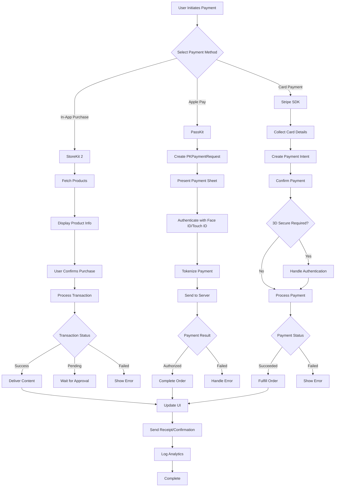
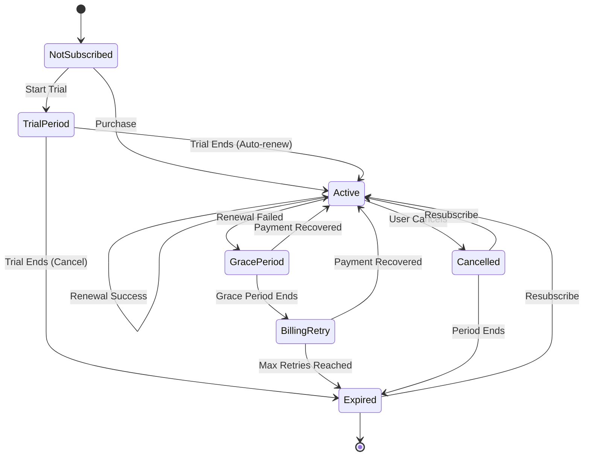

# iOS Payment Processing Framework

```
╔═══════════════════════════════════════════════════════════════════════════════╗
║                                                                               ║
║     ██████╗  █████╗ ██╗   ██╗███╗   ███╗███████╗███╗   ██╗████████╗          ║
║     ██╔══██╗██╔══██╗╚██╗ ██╔╝████╗ ████║██╔════╝████╗  ██║╚══██╔══╝          ║
║     ██████╔╝███████║ ╚████╔╝ ██╔████╔██║█████╗  ██╔██╗ ██║   ██║             ║
║     ██╔═══╝ ██╔══██║  ╚██╔╝  ██║╚██╔╝██║██╔══╝  ██║╚██╗██║   ██║             ║
║     ██║     ██║  ██║   ██║   ██║ ╚═╝ ██║███████╗██║ ╚████║   ██║             ║
║     ╚═╝     ╚═╝  ╚═╝   ╚═╝   ╚═╝     ╚═╝╚══════╝╚═╝  ╚═══╝   ╚═╝             ║
║                                                                               ║
║            ██╗  ██╗██╗████████╗                                               ║
║            ██║ ██╔╝██║╚══██╔══╝                                               ║
║            █████╔╝ ██║   ██║                                                  ║
║            ██╔═██╗ ██║   ██║                                                  ║
║            ██║  ██╗██║   ██║                                                  ║
║            ╚═╝  ╚═╝╚═╝   ╚═╝                                                  ║
║                                                                               ║
║          Unified iOS Payment Processing • StoreKit 2 • Apple Pay • Stripe    ║
╚═══════════════════════════════════════════════════════════════════════════════╝
```

<p align="center">
  <a href="https://swift.org"></a>
  <a href="https://developer.apple.com/ios/"></a>
  <a href="https://developer.apple.com/xcode/"></a>
  <a href="LICENSE"></a>
</p>

<p align="center">
  <a href="https://github.com/muhittincamdali/iOS-Payment-Processing-Framework/actions"></a>
  <a href="https://github.com/muhittincamdali/iOS-Payment-Processing-Framework"></a>
  <a href="https://swift.org/package-manager/"></a>
  <a href="https://codecov.io"></a>
</p>

<p align="center">
  <strong>A production-ready payment processing framework for iOS apps.</strong><br>
  StoreKit 2 In-App Purchases, Apple Pay, and Stripe — all in one unified API.
</p>

---

## Table of Contents

- [Features](#features)
- [Payment Methods](#payment-methods)
- [Payment Flow](#payment-flow)
- [Installation](#installation)
- [Quick Start](#quick-start)
- [StoreKit 2 Integration](#storekit-2-integration)
- [Apple Pay Integration](#apple-pay-integration)
- [Stripe Integration](#stripe-integration)
- [Subscription Handling](#subscription-handling)
- [Security](#security)
- [Requirements](#requirements)
- [Documentation](#documentation)
- [License](#license)

---

## Features

- 🛒 **StoreKit 2** — Modern async/await In-App Purchase API
- 💳 **Apple Pay** — Native Apple Pay with PassKit integration
- 💰 **Stripe** — Card payments and payment intents
- 🔄 **Subscriptions** — Auto-renewable subscription management
- 🔐 **Receipt Validation** — Server-side and on-device validation
- 🛡️ **Fraud Detection** — Built-in risk analysis engine
- 📊 **Analytics** — Transaction metrics and reporting
- 🎨 **Payment UI** — Ready-to-use payment sheet components

---

## Payment Methods

| Method | Provider | Features | Use Case |
|--------|----------|----------|----------|
| **StoreKit 2** | Apple | In-App Purchases, Consumables, Non-consumables, Subscriptions | Digital goods, Premium features |
| **Apple Pay** | Apple | Touch ID/Face ID, Card on file, Express checkout | Physical goods, Services |
| **Stripe** | Stripe | Cards, ACH, SEPA, 135+ currencies | E-commerce, Marketplaces |

### Comparison Matrix

| Feature | StoreKit 2 | Apple Pay | Stripe |
|---------|:----------:|:---------:|:------:|
| Digital Goods | ✅ | ❌ | ❌ |
| Physical Goods | ❌ | ✅ | ✅ |
| Subscriptions | ✅ | ❌ | ✅ |
| One-time Purchase | ✅ | ✅ | ✅ |
| Apple Commission | 15-30% | None | None |
| Card Storage | N/A | Wallet | Stripe |
| Refunds | App Store | Merchant | Merchant |

---

## Payment Flow



---

## Installation

### Swift Package Manager

Add the following to your `Package.swift`:

```swift
dependencies: [
    .package(
        url: "https://github.com/muhittincamdali/iOS-Payment-Processing-Framework.git",
        from: "1.0.0"
    )
]
```

Or add it via Xcode:
1. File → Add Package Dependencies
2. Enter: `https://github.com/muhittincamdali/iOS-Payment-Processing-Framework.git`
3. Select version and add to your target

---

## Quick Start

```swift
import PaymentProcessingFramework

// Initialize the payment processor
let config = PaymentConfiguration(
    merchantId: "merchant.com.yourapp",
    apiKey: "your_api_key",
    environment: .production,
    supportedPaymentMethods: [.applePay, .creditCard]
)

let processor = PaymentProcessor(configuration: config)

// Process a payment
let request = PaymentRequest(
    amount: 29.99,
    currency: .usd,
    paymentMethod: .applePay,
    description: "Premium Subscription"
)

processor.processPayment(request) { result in
    switch result {
    case .success(let transaction):
        print("Payment successful: \(transaction.id)")
    case .failure(let error):
        print("Payment failed: \(error.localizedDescription)")
    }
}
```

---

## StoreKit 2 Integration

### Fetching Products

```swift
import PaymentProcessingFramework
import StoreKit

class StoreManager {
    private var products: [Product] = []
    
    func fetchProducts() async throws {
        let productIds = [
            "com.app.premium.monthly",
            "com.app.premium.yearly",
            "com.app.coins.100"
        ]
        
        products = try await Product.products(for: productIds)
        
        for product in products {
            print("\(product.displayName): \(product.displayPrice)")
        }
    }
}
```

### Purchasing Products

```swift
func purchase(_ product: Product) async throws -> Transaction {
    let result = try await product.purchase()
    
    switch result {
    case .success(let verification):
        let transaction = try checkVerified(verification)
        
        // Deliver content to the user
        await deliverContent(for: transaction)
        
        // Finish the transaction
        await transaction.finish()
        
        return transaction
        
    case .userCancelled:
        throw PurchaseError.cancelled
        
    case .pending:
        throw PurchaseError.pending
        
    @unknown default:
        throw PurchaseError.unknown
    }
}

private func checkVerified<T>(_ result: VerificationResult<T>) throws -> T {
    switch result {
    case .unverified:
        throw PurchaseError.verificationFailed
    case .verified(let item):
        return item
    }
}
```

### Listening for Transactions

```swift
func observeTransactionUpdates() async {
    for await result in Transaction.updates {
        do {
            let transaction = try checkVerified(result)
            
            // Handle the transaction
            await handleTransaction(transaction)
            
            // Always finish
            await transaction.finish()
        } catch {
            print("Transaction verification failed: \(error)")
        }
    }
}
```

---

## Apple Pay Integration

### Setup

1. Enable Apple Pay in your app's capabilities
2. Create a Merchant ID in the Apple Developer Portal
3. Configure payment processing certificate

### Implementation

```swift
import PassKit
import PaymentProcessingFramework

class ApplePayManager: NSObject {
    
    func canMakePayments() -> Bool {
        return PKPaymentAuthorizationController.canMakePayments(
            usingNetworks: [.visa, .masterCard, .amex]
        )
    }
    
    func requestPayment(amount: Decimal, description: String) {
        let request = PKPaymentRequest()
        request.merchantIdentifier = "merchant.com.yourapp"
        request.supportedNetworks = [.visa, .masterCard, .amex, .discover]
        request.merchantCapabilities = .threeDSecure
        request.countryCode = "US"
        request.currencyCode = "USD"
        
        request.paymentSummaryItems = [
            PKPaymentSummaryItem(
                label: description,
                amount: NSDecimalNumber(decimal: amount)
            ),
            PKPaymentSummaryItem(
                label: "Your Company",
                amount: NSDecimalNumber(decimal: amount),
                type: .final
            )
        ]
        
        let controller = PKPaymentAuthorizationController(paymentRequest: request)
        controller?.delegate = self
        controller?.present()
    }
}

extension ApplePayManager: PKPaymentAuthorizationControllerDelegate {
    
    func paymentAuthorizationController(
        _ controller: PKPaymentAuthorizationController,
        didAuthorizePayment payment: PKPayment,
        handler completion: @escaping (PKPaymentAuthorizationResult) -> Void
    ) {
        // Send payment.token to your server for processing
        Task {
            do {
                let success = try await processPaymentOnServer(payment.token)
                completion(PKPaymentAuthorizationResult(
                    status: success ? .success : .failure,
                    errors: nil
                ))
            } catch {
                completion(PKPaymentAuthorizationResult(
                    status: .failure,
                    errors: [error]
                ))
            }
        }
    }
    
    func paymentAuthorizationControllerDidFinish(
        _ controller: PKPaymentAuthorizationController
    ) {
        controller.dismiss()
    }
}
```

---

## Stripe Integration

### Configuration

```swift
import PaymentProcessingFramework

let stripe = StripeManager(
    publishableKey: "pk_live_xxxxx",
    merchantId: "merchant.com.yourapp"
)
```

### Creating Payment Intent

```swift
// Server-side: Create a PaymentIntent and return client secret
// Client-side: Confirm the payment

func processCardPayment(amount: Int, currency: String) async throws {
    // 1. Create PaymentIntent on your server
    let clientSecret = try await createPaymentIntentOnServer(
        amount: amount,
        currency: currency
    )
    
    // 2. Collect card details
    let cardParams = CardParams(
        number: "4242424242424242",
        expMonth: 12,
        expYear: 2025,
        cvc: "123"
    )
    
    // 3. Confirm the payment
    let result = try await stripe.confirmPayment(
        clientSecret: clientSecret,
        cardParams: cardParams
    )
    
    switch result.status {
    case .succeeded:
        print("Payment successful!")
    case .requiresAction:
        // Handle 3D Secure authentication
        try await handle3DSecure(result)
    case .requiresPaymentMethod:
        print("Payment method failed")
    default:
        print("Unexpected status: \(result.status)")
    }
}
```

### Using Payment Sheet

```swift
func presentPaymentSheet() async throws {
    // Configure the payment sheet
    var configuration = PaymentSheet.Configuration()
    configuration.merchantDisplayName = "Your App Name"
    configuration.applePay = .init(
        merchantId: "merchant.com.yourapp",
        merchantCountryCode: "US"
    )
    
    // Create payment sheet
    let paymentSheet = PaymentSheet(
        paymentIntentClientSecret: clientSecret,
        configuration: configuration
    )
    
    // Present it
    paymentSheet.present(from: viewController) { result in
        switch result {
        case .completed:
            print("Payment completed!")
        case .canceled:
            print("Payment canceled")
        case .failed(let error):
            print("Payment failed: \(error)")
        }
    }
}
```

---

## Subscription Handling

### Subscription Lifecycle



### Managing Subscriptions

```swift
class SubscriptionManager {
    
    // Check current subscription status
    func checkSubscriptionStatus() async -> SubscriptionStatus {
        for await result in Transaction.currentEntitlements {
            guard case .verified(let transaction) = result else {
                continue
            }
            
            if transaction.productType == .autoRenewable {
                // Check if subscription is still valid
                if let expirationDate = transaction.expirationDate,
                   expirationDate > Date() {
                    return .active(expiresAt: expirationDate)
                }
            }
        }
        return .inactive
    }
    
    // Get subscription info
    func getSubscriptionInfo() async throws -> SubscriptionInfo? {
        guard let status = try await Product.SubscriptionInfo.status(
            for: "com.app.premium"
        ).first else {
            return nil
        }
        
        return SubscriptionInfo(
            state: status.state,
            renewalState: status.renewalInfo,
            transaction: status.transaction
        )
    }
    
    // Handle subscription state changes
    func handleSubscriptionState(_ state: Product.SubscriptionInfo.RenewalState) {
        switch state {
        case .subscribed:
            // Full access
            enablePremiumFeatures()
            
        case .expired:
            // Access revoked
            disablePremiumFeatures()
            
        case .inBillingRetryPeriod:
            // Show payment issue banner
            showPaymentIssueBanner()
            
        case .inGracePeriod:
            // Still has access, but show warning
            showGracePeriodWarning()
            
        case .revoked:
            // Refunded or revoked
            handleRevocation()
            
        default:
            break
        }
    }
}
```

### Restoring Purchases

```swift
func restorePurchases() async throws {
    // Sync with App Store
    try await AppStore.sync()
    
    // Check all current entitlements
    var restoredCount = 0
    
    for await result in Transaction.currentEntitlements {
        guard case .verified(let transaction) = result else {
            continue
        }
        
        // Restore access for each valid transaction
        await restoreAccess(for: transaction)
        restoredCount += 1
    }
    
    if restoredCount > 0 {
        showAlert("Restored \(restoredCount) purchase(s)")
    } else {
        showAlert("No purchases to restore")
    }
}
```

---

## Security

### Built-in Protection

| Feature | Description |
|---------|-------------|
| **Encryption** | AES-256 for sensitive data at rest |
| **TLS 1.3** | All network communication encrypted |
| **Certificate Pinning** | Prevents MITM attacks |
| **Receipt Validation** | Server-side StoreKit receipt verification |
| **Fraud Detection** | ML-based transaction risk scoring |
| **PCI DSS** | Stripe handles card data (PCI Level 1) |

### Receipt Validation

```swift
func validateReceipt() async throws -> Bool {
    // Get the receipt data
    guard let receiptURL = Bundle.main.appStoreReceiptURL,
          let receiptData = try? Data(contentsOf: receiptURL) else {
        throw ReceiptError.noReceipt
    }
    
    // Encode for transmission
    let receiptString = receiptData.base64EncodedString()
    
    // Validate on your server (recommended)
    let isValid = try await validateReceiptOnServer(receiptString)
    
    return isValid
}
```

---

## Requirements

| Requirement | Minimum Version |
|-------------|-----------------|
| iOS | 15.0+ |
| macOS | 12.0+ |
| Xcode | 15.0+ |
| Swift | 5.9+ |

### Dependencies

- [swift-crypto](https://github.com/apple/swift-crypto) - Cryptographic operations
- [swift-log](https://github.com/apple/swift-log) - Logging infrastructure
- [swift-async-algorithms](https://github.com/apple/swift-async-algorithms) - Async sequences
- [swift-collections](https://github.com/apple/swift-collections) - Data structures

---

## Documentation

| Resource | Link |
|----------|------|
| API Reference | [Documentation](Documentation/) |
| Examples | [Examples](Examples/) |
| Changelog | [CHANGELOG.md](CHANGELOG.md) |
| Contributing | [CONTRIBUTING.md](CONTRIBUTING.md) |

---

## License

This project is licensed under the MIT License - see the [LICENSE](LICENSE) file for details.

---

<p align="center">
  Built with ❤️ by <a href="https://github.com/muhittincamdali">Muhittin Camdali</a>
</p>
