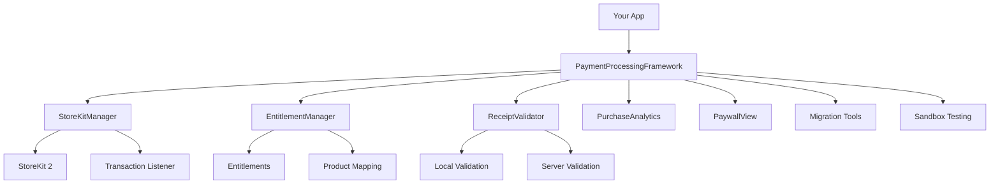

# PaymentKit

<div align="center">

```
╔═══════════════════════════════════════════════════════════════════════════════════════╗
║                                                                                       ║
║    ██████╗  █████╗ ██╗   ██╗███╗   ███╗███████╗███╗   ██╗████████╗██╗  ██╗██╗████████╗║
║    ██╔══██╗██╔══██╗╚██╗ ██╔╝████╗ ████║██╔════╝████╗  ██║╚══██╔══╝██║ ██╔╝██║╚══██╔══╝║
║    ██████╔╝███████║ ╚████╔╝ ██╔████╔██║█████╗  ██╔██╗ ██║   ██║   █████╔╝ ██║   ██║   ║
║    ██╔═══╝ ██╔══██║  ╚██╔╝  ██║╚██╔╝██║██╔══╝  ██║╚██╗██║   ██║   ██╔═██╗ ██║   ██║   ║
║    ██║     ██║  ██║   ██║   ██║ ╚═╝ ██║███████╗██║ ╚████║   ██║   ██║  ██╗██║   ██║   ║
║    ╚═╝     ╚═╝  ╚═╝   ╚═╝   ╚═╝     ╚═╝╚══════╝╚═╝  ╚═══╝   ╚═╝   ╚═╝  ╚═╝╚═╝   ╚═╝   ║
║                                                                                       ║
║                     The Most Complete StoreKit 2 Framework for iOS                    ║
╚═══════════════════════════════════════════════════════════════════════════════════════╝
```

[](https://swift.org)
[](https://developer.apple.com/ios/)
[](https://developer.apple.com/macos/)
[](LICENSE)

[](https://github.com/muhittincamdali/iOS-Payment-Processing-Framework/actions)
[](https://swift.org/package-manager/)
[](https://cocoapods.org)
[](https://developer.apple.com)

**Production-ready StoreKit 2 framework with entitlements, receipt validation, paywalls, and migration tools.**

[Features](#features) • [Installation](#installation) • [Quick Start](#quick-start) • [Documentation](#documentation) • [Migration](#migration)

</div>

---

## Why PaymentKit?

| Feature | PaymentKit | RevenueCat | SwiftyStoreKit |
|---------|:----------:|:----------:|:--------------:|
| **StoreKit 2 Native** | ✅ | ✅ | ❌ (SK1 only) |
| **No Server Required** | ✅ | ❌ | ✅ |
| **Entitlement Management** | ✅ | ✅ | ❌ |
| **Built-in Paywalls** | ✅ | 💰 Paid | ❌ |
| **Promotional Offers** | ✅ | ✅ | ❌ |
| **Receipt Validation** | ✅ | ✅ | ✅ |
| **Migration Tools** | ✅ | ❌ | ❌ |
| **Sandbox Testing Utils** | ✅ | ❌ | ❌ |
| **Free & Open Source** | ✅ | ❌ | ✅ |
| **Async/Await API** | ✅ | ✅ | ❌ |
| **SwiftUI Support** | ✅ | ✅ | ❌ |
| **Analytics Built-in** | ✅ | 💰 Paid | ❌ |

---

## Features

### 🛒 StoreKit 2 Integration
- Native async/await API
- Product fetching with caching
- Purchase flow handling
- Transaction verification
- Automatic transaction listener

### 📋 Entitlement Management
- Product-to-entitlement mapping
- Feature flags based on purchases
- Automatic sync with transactions
- Flexible configuration

### 🔄 Subscription Lifecycle
- Status tracking (active, trial, grace period, expired)
- Renewal management
- Upgrade/downgrade handling
- Cancellation detection

### 🔐 Receipt Validation
- On-device validation (StoreKit 2)
- Server-side validation support
- JWS transaction verification
- Fraud detection

### 💰 Promotional Offers
- Introductory offers
- Promotional codes
- Offer eligibility checking
- Server signature generation

### 🎨 Paywall UI
- Beautiful SwiftUI paywalls
- Fully customizable themes
- Multiple templates
- A/B testing ready

### 📊 Analytics
- Purchase tracking
- Revenue metrics
- Error monitoring
- Custom event support

### 🔧 Developer Tools
- Sandbox testing utilities
- Transaction debugging
- Environment detection
- Comprehensive logging

### 🚀 Migration Tools
- RevenueCat migration helper
- SwiftyStoreKit migration helper
- Data transfer utilities
- API compatibility layer

---

## Installation

### Swift Package Manager

Add to your `Package.swift`:

```swift
dependencies: [
    .package(url: "https://github.com/muhittincamdali/iOS-Payment-Processing-Framework.git", from: "2.0.0")
]
```

Or in Xcode: **File → Add Package Dependencies** and enter:
```
https://github.com/muhittincamdali/iOS-Payment-Processing-Framework.git
```

### CocoaPods

```ruby
pod 'iOSPaymentProcessingFramework', '~> 2.0'
```

---

## Quick Start

### 1. Configure Products

```swift
import PaymentProcessingFramework

// Configure your product IDs
StoreKitManager.shared.configure(productIds: [
    "com.yourapp.premium.monthly",
    "com.yourapp.premium.yearly",
    "com.yourapp.coins.100"
])
```

### 2. Fetch Products

```swift
// Fetch products from App Store
let products = try await StoreKitManager.shared.fetchProducts()

for product in products {
    print("\(product.displayName): \(product.displayPrice)")
}
```

### 3. Purchase

```swift
// Purchase a product
let transaction = try await StoreKitManager.shared.purchase(product)
print("Purchased: \(transaction.productID)")
```

### 4. Check Entitlements

```swift
// Check if user has premium access
if StoreKitManager.shared.isEntitled(to: "premium") {
    // Unlock premium features
}
```

---

## Subscription Management

### Check Subscription Status

```swift
let status = await StoreKitManager.shared.getSubscriptionStatus()

switch status {
case .subscribed(let details):
    print("Active until: \(details.expirationDate!)")
    
case .inTrial(let details):
    print("Trial ends: \(details.expirationDate!)")
    
case .inGracePeriod(let details):
    print("Payment issue - grace period")
    
case .expired:
    print("Subscription expired")
    
case .notSubscribed:
    print("Not subscribed")
}
```

### Restore Purchases

```swift
let restoredCount = try await StoreKitManager.shared.restorePurchases()
print("Restored \(restoredCount) purchases")
```

### Manage Subscriptions

```swift
// Opens App Store subscription management
await StoreKitManager.shared.manageSubscriptions()
```

---

## Entitlement Configuration

### Map Products to Entitlements

```swift
// Configure entitlement mappings
StoreKitManager.shared.entitlementManager.configureMappings([
    "com.yourapp.premium.monthly": ["premium", "remove_ads"],
    "com.yourapp.premium.yearly": ["premium", "remove_ads", "cloud_sync"],
    "com.yourapp.lifetime": ["premium", "remove_ads", "cloud_sync", "vip"]
])
```

### Check Entitlements

```swift
// Single entitlement
if StoreKitManager.shared.isEntitled(to: "premium") {
    showPremiumContent()
}

// Multiple entitlements
if StoreKitManager.shared.entitlements.hasAllEntitlements(["premium", "cloud_sync"]) {
    enableCloudSync()
}
```

---

## PaywallView

### Basic Usage

```swift
import PaymentProcessingUI

struct ContentView: View {
    @State private var showPaywall = false
    
    var body: some View {
        Button("Upgrade to Premium") {
            showPaywall = true
        }
        .sheet(isPresented: $showPaywall) {
            PaywallView(
                productIds: ["com.app.monthly", "com.app.yearly"],
                onPurchaseComplete: { transaction in
                    print("Purchased: \(transaction.productID)")
                }
            )
        }
    }
}
```

### Custom Configuration

```swift
let config = PaywallConfiguration.builder()
    .title("Unlock Premium")
    .subtitle("Get access to all features")
    .headerIcon("crown.fill")
    .accentColor(.purple)
    .addFeature(icon: "infinity", title: "Unlimited Access")
    .addFeature(icon: "icloud", title: "Cloud Sync")
    .addFeature(icon: "nosign", title: "Remove Ads")
    .legalURLs(
        privacy: URL(string: "https://yourapp.com/privacy"),
        terms: URL(string: "https://yourapp.com/terms")
    )
    .build()

PaywallView(
    productIds: productIds,
    configuration: config
)
```

---

## Migration from RevenueCat

```swift
import PaymentProcessingFramework

// RevenueCat compatibility layer
let migration = RevenueCatMigration.shared

// Same API you're used to
let customerInfo = try await migration.getCustomerInfo()

if customerInfo.entitlements["premium"]?.isActive == true {
    // User has premium
}

// Get offerings
let offerings = try await migration.getOfferings()
let monthlyPackage = offerings.current?.monthly

// Purchase
let (transaction, info) = try await migration.purchase(package: monthlyPackage!)
```

---

## Migration from SwiftyStoreKit

```swift
import PaymentProcessingFramework

let migration = SwiftyStoreKitMigration.shared

// Same API you're used to
migration.retrieveProductsInfo(["product_id"]) { result in
    if let product = result.retrievedProducts.first {
        print("Price: \(product.price)")
    }
}

migration.purchaseProduct("product_id") { result in
    switch result {
    case .success(let purchase):
        print("Purchased: \(purchase.productId)")
    case .error(let error):
        print("Error: \(error)")
    }
}
```

---

## Sandbox Testing

```swift
import PaymentProcessingFramework

let sandbox = SandboxTesting.shared

// Detect environment
let env = await sandbox.detectEnvironment()
print("Is Sandbox: \(env.isSandbox)")

// Get all transactions for debugging
let transactions = await sandbox.getAllTransactions()

// Print detailed debug info
await sandbox.printAllTransactions()

// Generate test report
let report = await sandbox.generateTestReport()
print("Total transactions: \(report.totalTransactions)")

// Clear stuck transactions
let finished = await sandbox.finishAllUnfinishedTransactions()
```

---

## Architecture



---

## API Reference

### StoreKitManager

| Method | Description |
|--------|-------------|
| `configure(productIds:)` | Set product IDs |
| `fetchProducts()` | Fetch products from App Store |
| `purchase(_:)` | Purchase a product |
| `restorePurchases()` | Restore previous purchases |
| `getSubscriptionStatus()` | Get current subscription status |
| `isEntitled(to:)` | Check entitlement |
| `manageSubscriptions()` | Open subscription management |

### PaywallView

| Parameter | Description |
|-----------|-------------|
| `productIds` | Array of product IDs to display |
| `configuration` | Visual and behavioral configuration |
| `onPurchaseComplete` | Called when purchase succeeds |
| `onDismiss` | Called when user dismisses |

---

## Requirements

| Requirement | Version |
|-------------|---------|
| iOS | 15.0+ |
| macOS | 12.0+ |
| tvOS | 15.0+ |
| watchOS | 8.0+ |
| Xcode | 15.0+ |
| Swift | 5.9+ |

---

## Contributing

Contributions are welcome! Please read [CONTRIBUTING.md](CONTRIBUTING.md) first.

1. Fork the repository
2. Create your feature branch (`git checkout -b feature/amazing`)
3. Commit changes (`git commit -m 'feat: add amazing feature'`)
4. Push to branch (`git push origin feature/amazing`)
5. Open a Pull Request

---

## License

This project is licensed under the MIT License - see [LICENSE](LICENSE) for details.

---

<div align="center">

**Built with ❤️ by [Muhittin Camdali](https://github.com/muhittincamdali)**

<a href="https://star-history.com/#muhittincamdali/iOS-Payment-Processing-Framework&Date">
  <picture>
    <source media="(prefers-color-scheme: dark)" srcset="https://api.star-history.com/svg?repos=muhittincamdali/iOS-Payment-Processing-Framework&type=Date&theme=dark" />
    <source media="(prefers-color-scheme: light)" srcset="https://api.star-history.com/svg?repos=muhittincamdali/iOS-Payment-Processing-Framework&type=Date" />
    
  </picture>
</a>

</div>
